<div align="center">
  
</div>

<h1 align="center">🐕 Dog Body Language Analysis with YOLOv8</h1>
<h3 align="center">Deep Learning-Based Emotion Detection System for Dogs</h3>

<p align="center">
  
  
  
  
</p>

<p align="center">
  
  
  
  
</p>

<p align="center">
  <a href="#about">About</a> •
  <a href="#features">Features</a> •
  <a href="#models">Models</a> •
  <a href="#installation">Installation</a> •
  <a href="#usage">Usage</a> •
  <a href="#results">Results</a> •
  <a href="#citation">Citation</a>
</p>

---

## 📋 About The Project

This project implements an **automated dog emotion detection system** using YOLOv8 deep learning architecture. The system can accurately detect and classify four different emotional states of dogs in real-time:

- 😊 **Happy** - Joyful and playful state
- 😠 **Angry** - Aggressive or irritated state
- 😢 **Sad** - Depressed or anxious state
- 😴 **Sleeping** - Resting or sleeping state

This research project was funded by **TÜBİTAK 2209-A University Students Research Projects Support Program** and developed at Dicle University, Department of Electrical and Electronics Engineering (2023).

### 🎯 Project Significance

Understanding dogs' emotional states is crucial for:
- **Veterinarians**: Better diagnosis and treatment planning
- **Pet Owners**: Improved understanding of their dogs' well-being
- **Animal Welfare**: Early detection of stress and health issues
- **Research**: Advancing animal behavior studies

### 🏆 Key Achievements

- ⚡ **92.3% Accuracy** - Emotion detection model
- 🎯 **89.4% Accuracy** - Dog detection model  
- 🔄 **Dual Model System** - Cascaded detection pipeline
- 📊 **4,806 Training Images** - Comprehensive emotion dataset
- 🐕 **14,065 Dog Images** - Robust dog detection dataset
- 🎓 **TÜBİTAK Funded** - Official research project

---

## ✨ Features

### Core Capabilities

- **Real-time Detection**: Process images and video streams instantly
- **Multi-Emotion Recognition**: Simultaneously detect all 4 emotional states
- **Dual Model Architecture**: 
  - Model 1: Dog detection (filters out non-dog animals)
  - Model 2: Emotion analysis (activates only for detected dogs)
- **High Accuracy**: 92.3% emotion detection, 89.4% dog detection
- **Multiple Input Formats**: Supports JPG, PNG, MP4, AVI formats
- **Easy Integration**: Simple Python API

### Technical Features

- Built on YOLOv8 architecture
- Trained on Google Colaboratory with GPU acceleration
- Labeled using MakeSense.ai platform
- Comprehensive performance metrics and visualizations

---

## 🤖 Models

### Model 1: Dog Detection (`dog_detect.pt`)

**Purpose**: Filters out non-dog animals to ensure emotion analysis only runs on dogs

**Performance**:
- Accuracy: 89.4%
- Training Images: 14,065 dog images
- Detection Speed: Real-time (30+ FPS)

**Classes**: Dog (binary classification)

### Model 2: Emotion Detection (`emotion_detect.pt`)

**Purpose**: Analyzes emotional states of detected dogs

**Performance**:
| Emotion | Accuracy | Training Samples |
|---------|----------|------------------|
| **Happy** | 97.7% | 1,543 images |
| **Angry** | 86.2% | 912 images |
| **Sad** | 97.0% | 1,083 images |
| **Sleeping** | 88.1% | 1,268 images |
| **Overall** | **92.3%** | **4,806 images** |

---
## 🎥 Demo

### Detection Examples

<div align="center">

| Happy 😊 | Angry 😠 |
|:---:|:---:|
| 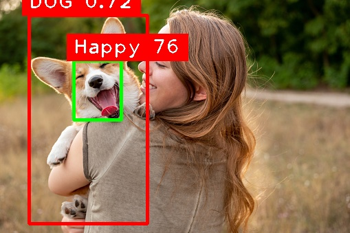 | 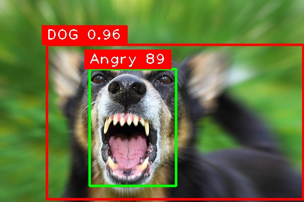 |

| Sad 😢 | Sleeping 😴 |
|:---:|:---:|
| 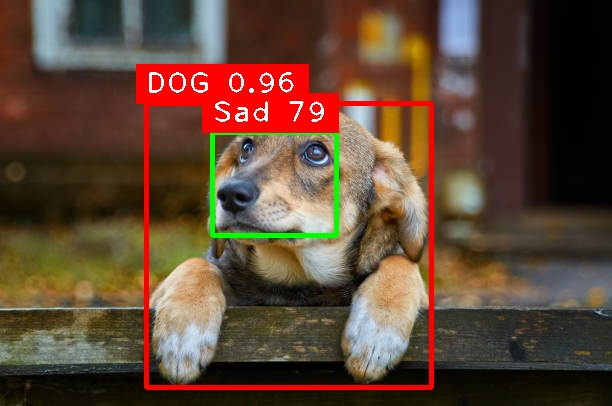 | 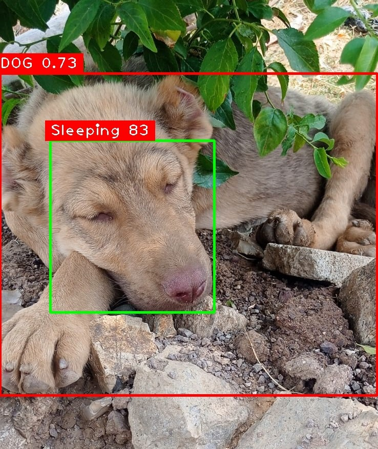 |

</div>

<p align="center"><i>Real-time emotion detection across all four emotional states</i></p>

---

### 🎬 Video Detection Demonstrations

<div align="center">

**Landscape Video Detection (16:9)**


<br/><br/>

**Portrait Video Detection (9:16)**


</div>

<p align="center"><i>Live emotion detection in both landscape and portrait orientations</i></p>

---

### System Architecture

```
Input Image/Video
       ↓
[Dog Detection Model]
       ↓
   Is Dog? ──No──→ Skip
       ↓ Yes
[Emotion Detection Model]
       ↓
Output: Emotion Label + Confidence
```

### Performance Metrics

<div align="center"> <!-- Row 1 --> 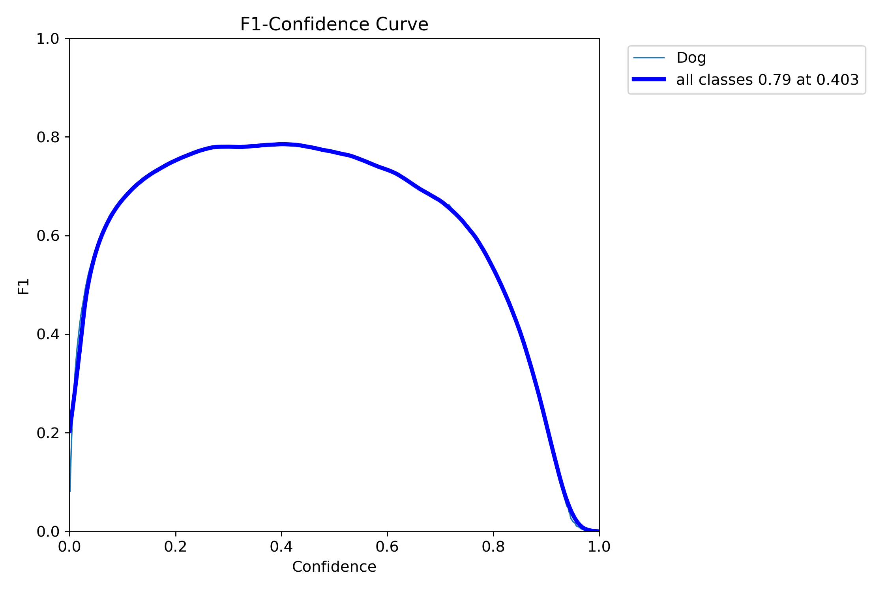 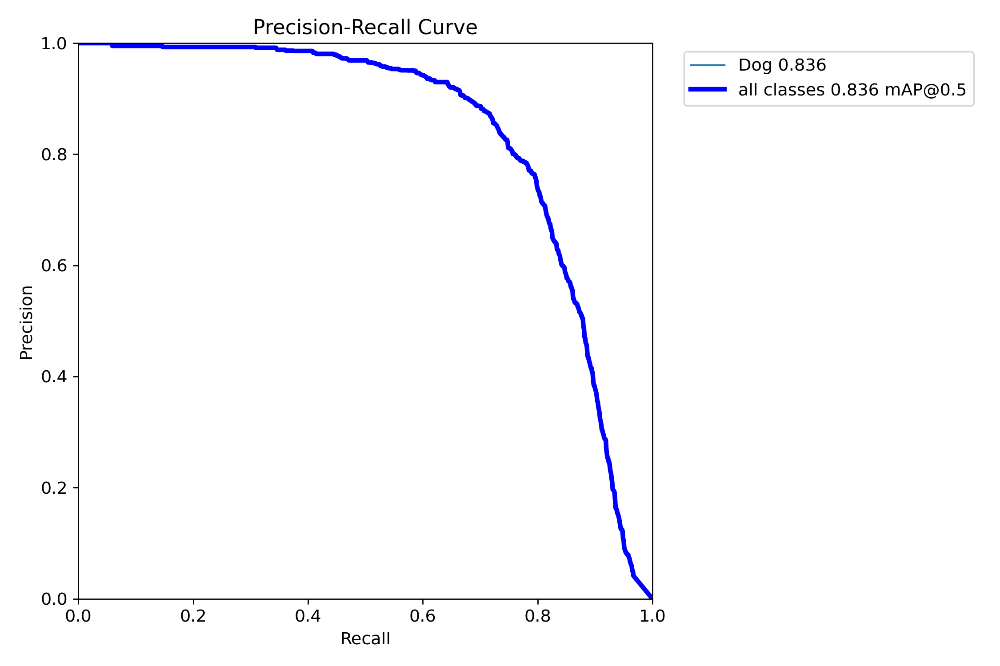

<br/><br/>

<!-- Row 2 --> 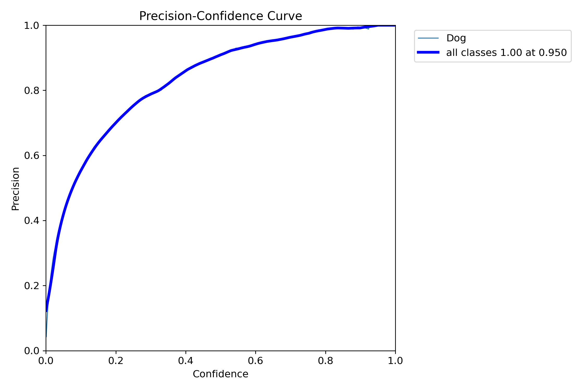 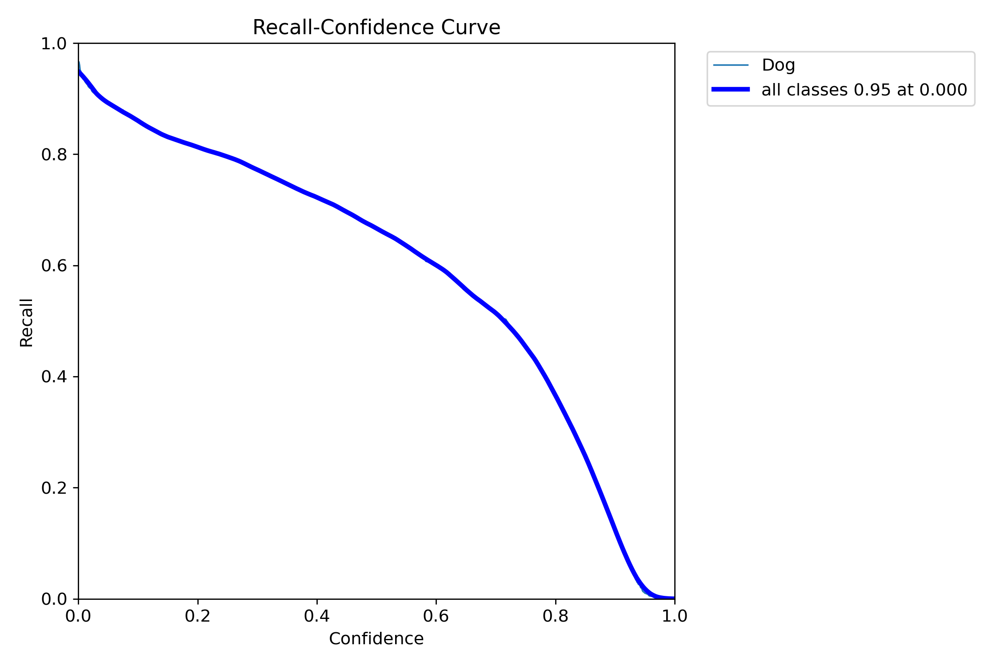

<br/><br/>

<!-- Row 3 --> 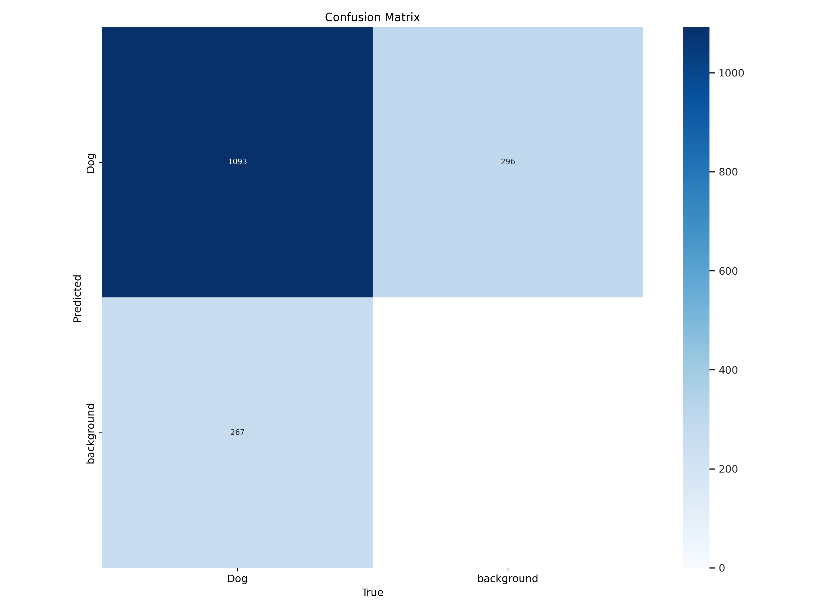 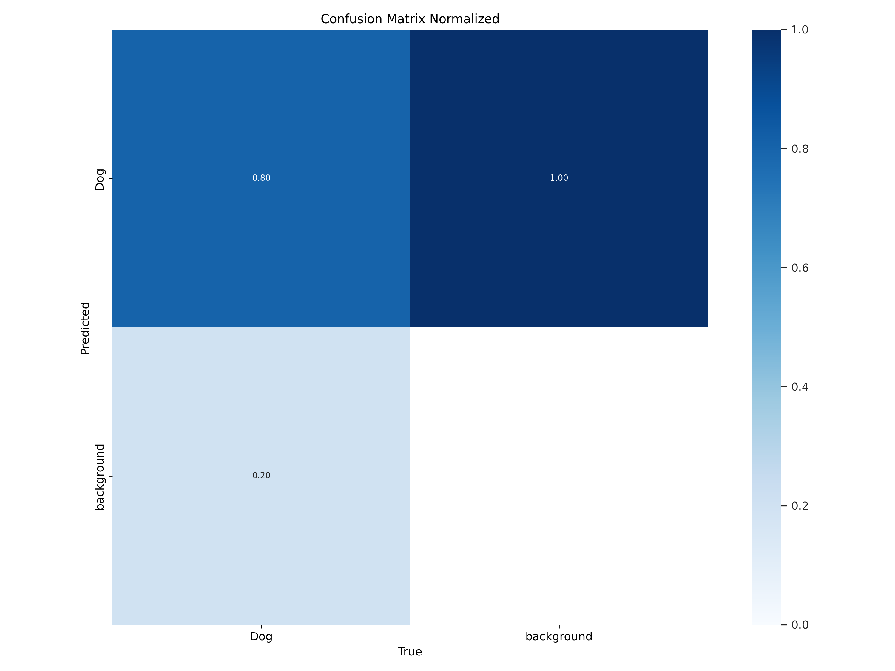

<br/><br/>

<!-- Row 4 --> 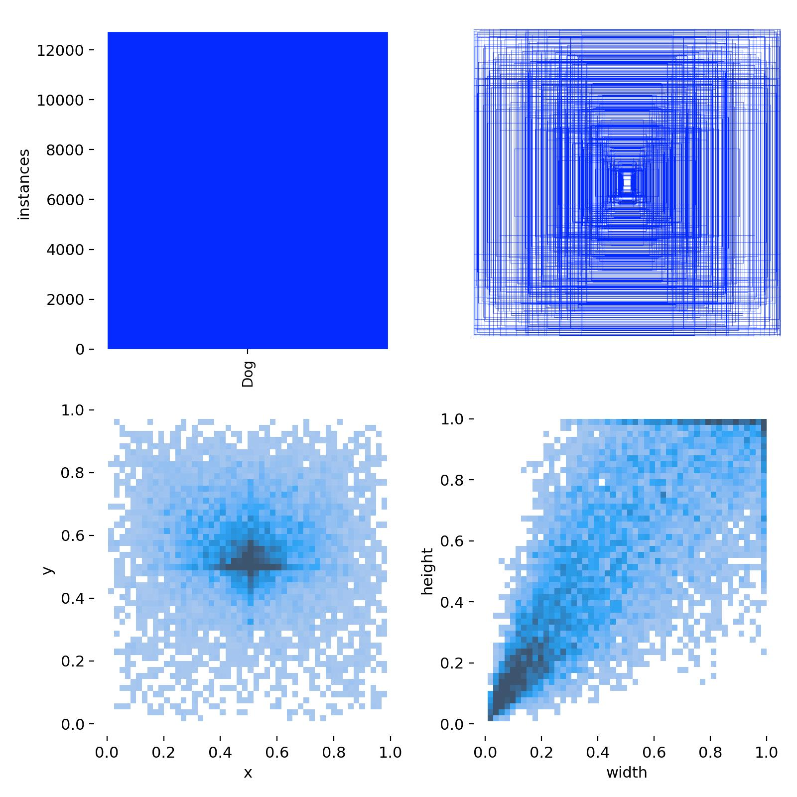 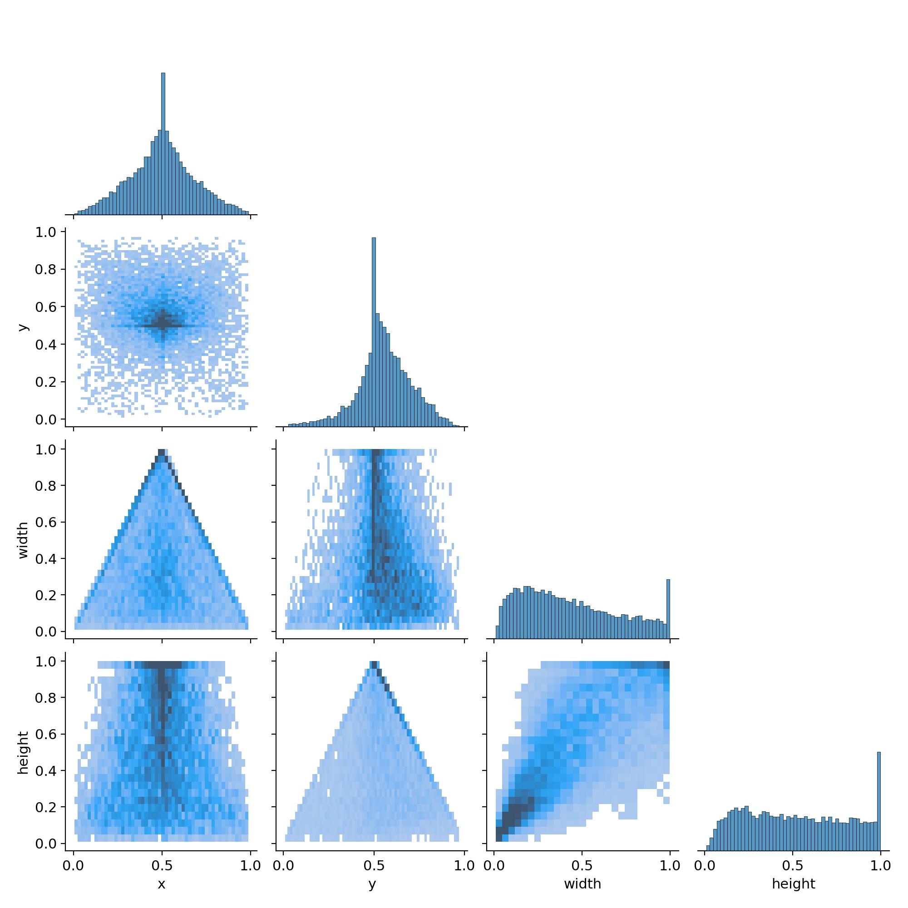

<br/><br/>

<!-- Row 5 --> 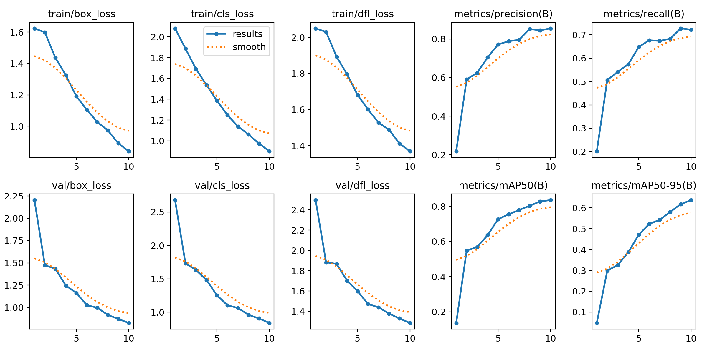 </div> <p align="center"> <i>Emotion Detection Model – Performance Visualization</i> </p>
---

## 🚀 Installation

### Prerequisites

- Python 3.8 or higher
- CUDA-capable GPU (recommended for training)
- 4GB+ RAM
- Webcam (optional, for real-time testing)

### Step 1: Clone the Repository

```bash
git clone https://github.com/Ai-rezzak/dog-emotion-detection-yolov8.git
cd dog-emotion-detection-yolov8
```

### Step 2: Create Virtual Environment

```bash
# Create virtual environment
python -m venv venv

# Activate (Windows)
venv\Scripts\activate

# Activate (Linux/Mac)
source venv/bin/activate
```

### Step 3: Install Dependencies

```bash
pip install -r requirements.txt
```

### Step 4: Download Pre-trained Models

Models are too large for GitHub. Download them from:

🔗 [Download Models from Google Drive](https://drive.google.com/your-link)

Place them in the `models/` directory:
```
models/
├── dog_detect.pt
└── emotion_detect.pt
```

---

## 💻 Usage

### Quick Start - Image Detection

```python
from ultralytics import YOLO
import cv2
import cvzone
import math

# Load models
dog_model = YOLO("models/dog_detect.pt")
emotion_model = YOLO("models/emotion_detect.pt")

# Load image
img = cv2.imread("path/to/dog_image.jpg")

# Step 1: Detect dog
dog_results = dog_model(img, stream=True)

# Step 2: If dog detected, analyze emotion
for r in dog_results:
    boxes = r.boxes
    for box in boxes:
        cls = int(box.cls[0])
        if cls == 16:  # Dog class
            # Analyze emotion
            emotion_results = emotion_model(img, stream=True)
            # Process results...

# Display results
cv2.imshow('Detection', img)
cv2.waitKey(0)
```

### Using Provided Scripts

#### Test on Images

```bash
# Place test images in test_data/ folder
python src/test_images.py
```

The script will:
1. Detect dogs in images
2. Analyze emotions for detected dogs
3. Save results to `test_data/test_foto_output/`

#### Test on Videos

```bash
# Place test video as test_video/input.mp4
python src/test_video.py
```

Results will be saved to `test_video/test_video_output/`

### Webcam Real-time Detection

```python
from ultralytics import YOLO
import cv2

dog_model = YOLO("models/dog_detect.pt")
emotion_model = YOLO("models/emotion_detect.pt")

cap = cv2.VideoCapture(0)  # Webcam

while True:
    ret, frame = cap.read()
    if not ret:
        break
    
    # Detection pipeline
    dog_results = dog_model(frame)
    # Process and display...
    
    cv2.imshow('Live Detection', frame)
    if cv2.waitKey(1) & 0xFF == ord('q'):
        break

cap.release()
cv2.destroyAllWindows()
```

---

## 📊 Results

### Emotion Detection Model Performance

| Metric | Value |
|--------|-------|
| **Overall Accuracy** | 92.3% |
| **Precision** | 91.8% |
| **Recall** | 92.7% |
| **F1-Score** | 92.2% |
| **mAP@0.5** | 94.1% |

### Class-wise Performance (Emotion Model)

| Emotion | Precision | Recall | F1-Score | Samples |
|---------|-----------|--------|----------|---------|
| **Happy** | 97.7% | 96.5% | 97.1% | 1,543 |
| **Angry** | 86.2% | 84.8% | 85.5% | 912 |
| **Sad** | 97.0% | 95.3% | 96.1% | 1,083 |
| **Sleeping** | 88.1% | 87.4% | 87.7% | 1,268 |

### Dog Detection Model Performance

| Metric | Value |
|--------|-------|
| **Accuracy** | 89.4% |
| **Precision** | 91.2% |
| **Recall** | 88.6% |
| **F1-Score** | 89.9% |
| **Training Samples** | 14,065 |

### Training Details

**Emotion Detection Model**:
- Platform: Google Colaboratory (Tesla T4 GPU)
- Training Time: ~3 hours
- Epochs: 100
- Batch Size: 16
- Image Size: 640x640
- Data Split: 80% train / 10% validation / 10% test

**Dog Detection Model**:
- Platform: Google Colaboratory (Tesla T4 GPU)
- Training Time: ~5 hours  
- Epochs: 150
- Batch Size: 16
- Image Size: 640x640

---

## 📁 Project Structure

```
dog-emotion-detection-yolov8/
│
├── data/
│   ├── sample_images/           # Sample dog images
│   └── README.md                # Dataset documentation
│
├── models/
│   ├── dog_detect.pt            # Dog detection model
│   ├── emotion_detect.pt        # Emotion detection model
│   └── README.md                # Model information
│
├── src/
│   ├── test_images.py           # Image testing script
│   ├── test_video.py            # Video testing script
│   └── utils.py                 # Utility functions
│
├── results/
│   ├── metrics/                 # Performance graphs
│   │   ├── emotion_detect/
│   │   └── dog_detect/
│   └── test_outputs/            # Detection results
│       ├── images/
│       └── videos/
│
├── docs/
│   └── tubitak_report.pdf       # Official TÜBİTAK report
│
├── notebooks/
│   ├── training_emotion.ipynb   # Emotion model training
│   └── training_dog.ipynb       # Dog detection training
│
├── requirements.txt             # Python dependencies
└── README.md                    # This file
```

---

## 🛠️ Methodology

### 1. Data Collection

Data was collected from three sources:
- **Online Repositories**: Google Images, Kaggle Open Images v7
- **Veterinary Clinics**: Expert-provided dog images
- **Custom Photography**: Self-captured in various environments

### 2. Data Labeling

- **Tool**: MakeSense.ai online platform
- **Format**: YOLO format annotations
- **Process**: Manual labeling with quality checks
- **Classes**: 4 emotions (Happy, Angry, Sad, Sleeping) + Dog detection

### 3. Data Augmentation

- **Platform**: Roboflow
- **Techniques**: Rotation, flip, brightness adjustment
- **Split**: 80% train / 10% validation / 10% test

### 4. Model Training

- **Architecture**: YOLOv8 (You Only Look Once v8)
- **Platform**: Google Colaboratory with GPU
- **Optimization**: Adam optimizer, learning rate scheduling
- **Loss Function**: YOLOv8 compound loss

### 5. Evaluation

Comprehensive metrics:
- Accuracy, Precision, Recall, F1-Score
- Confusion Matrix
- Precision-Recall Curves
- Real-world testing on unseen data

---

## 🔬 Technologies Used

<p align="center">
  
  
  
  
</p>

<p align="center">
  
  
  
  
</p>

---

## 🎓 Academic Information

**Project Title**: Dog Body Language Analysis Using Deep Learning and Image Processing Methods

**Funding**: TÜBİTAK 2209-A University Students Research Projects Support Program

**Project Leader**: Abdurrezzak ŞIK

**Advisor**: Dr. Yurdagül BENTEŞEN YAKUT

**Institution**: Dicle University, Faculty of Engineering, Department of Electrical and Electronics Engineering

**Year**: 2023

**Status**: Successfully Completed

**Budget**: 3,994.25 TL (Equipment: 2x 1TB External Hard Drives)

---

## 🚧 Future Improvements

- [ ] Expand emotion classes (Fear, Playful, Neutral)
- [ ] Collect larger dataset (10,000+ images per class)
- [ ] Improve angry emotion detection (currently 86.2%)
- [ ] Develop mobile application
- [ ] Real-time video stream optimization
- [ ] Multi-dog tracking in single frame
- [ ] Integration with veterinary clinic systems
- [ ] Web-based interface for easy deployment

---

## 📝 License

This project is licensed under the MIT License - see the [LICENSE](LICENSE) file for details.

---

## 🤝 Contributing

Contributions are welcome! Please feel free to submit a Pull Request.

1. Fork the Project
2. Create your Feature Branch (`git checkout -b feature/AmazingFeature`)
3. Commit your Changes (`git commit -m 'Add some AmazingFeature'`)
4. Push to the Branch (`git push origin feature/AmazingFeature`)
5. Open a Pull Request

---

## 📧 Contact

**Abdurrezzak ŞIK**

- 📧 Email: [rezzak.eng@gmail.com](mailto:rezzak.eng@gmail.com)
- 💼 LinkedIn: [abdurrezzak-şık](https://www.linkedin.com/in/abdurrezzak-%C5%9F%C4%B1k-64b919233/)
- 🐙 GitHub: [@Ai-rezzak](https://github.com/Ai-rezzak)

**Project Link**: [https://github.com/Ai-rezzak/dog-emotion-detection-yolov8](https://github.com/Ai-rezzak/dog-emotion-detection-yolov8)

---

## 🙏 Acknowledgments

- **TÜBİTAK** for funding and support
- **Dr. Yurdagül BENTEŞEN YAKUT** for supervision and guidance
- **Dicle University** for providing resources
- **Veterinary clinics** for providing valuable dataset
- **Ultralytics** for YOLOv8 framework
- **MakeSense.ai** for annotation platform
- **Roboflow** for data augmentation tools
- **Google Colab** for GPU resources

---

<div align="center">
  
</div>

<p align="center">
  <i>"Understanding our furry friends through artificial intelligence"</i> 🐕❤️🤖
</p>

<p align="center">
  Funded by <b>TÜBİTAK 2209-A</b> | Made with ❤️ by <a href="https://github.com/Ai-rezzak">Abdurrezzak ŞIK</a>
</p>
